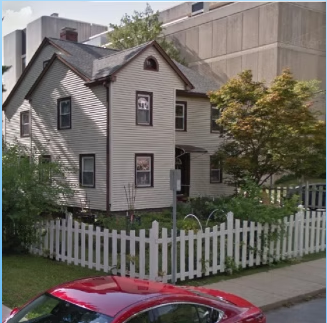
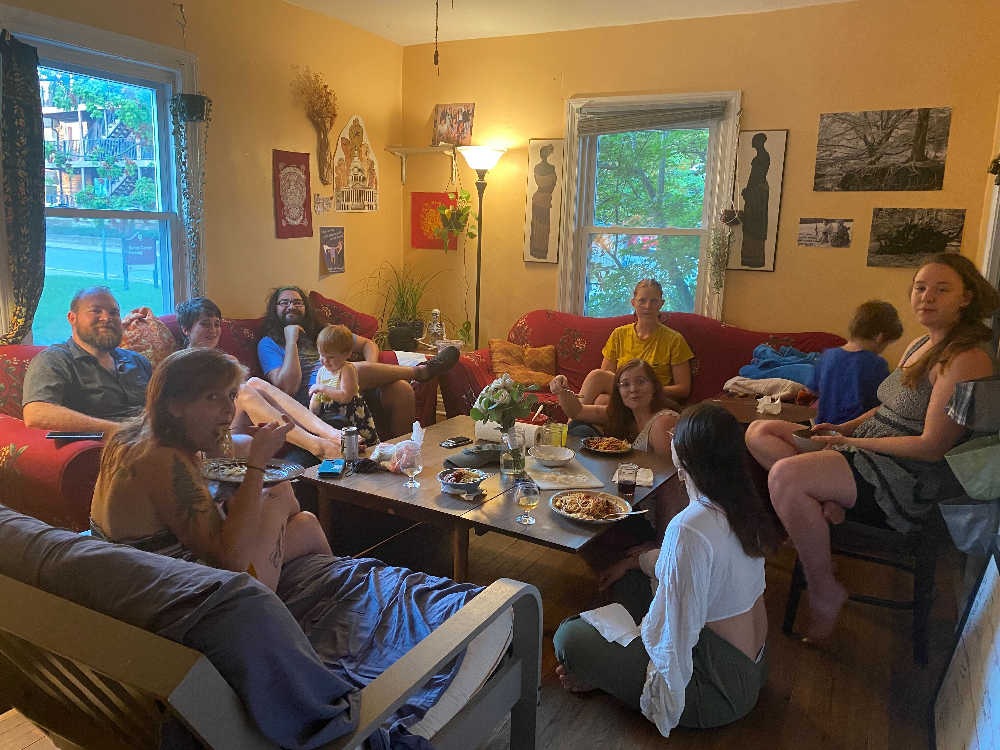
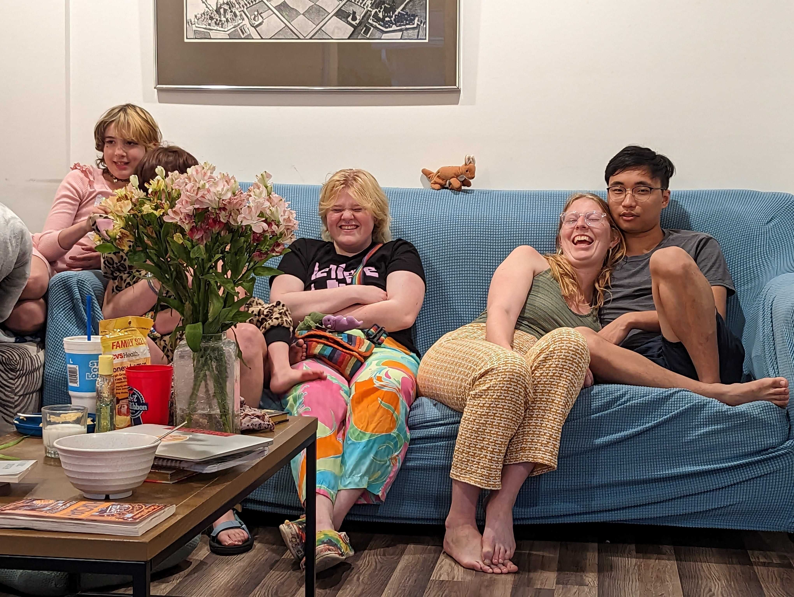
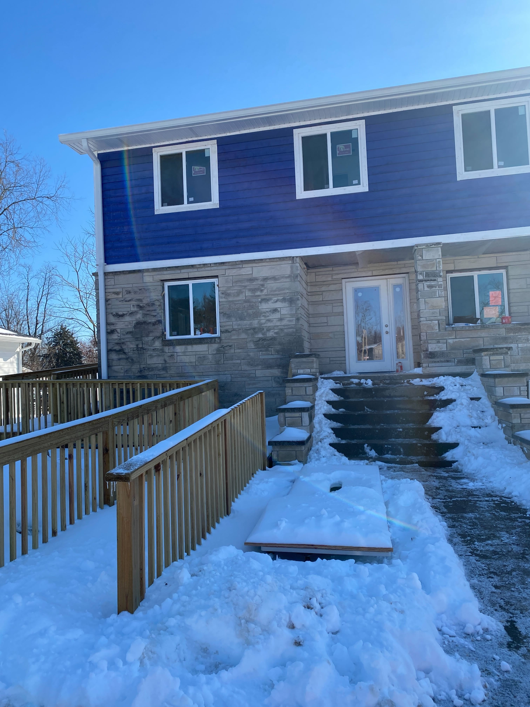
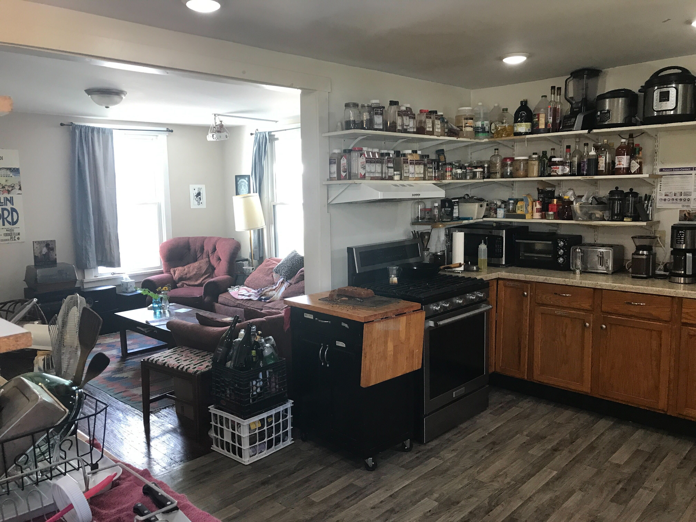
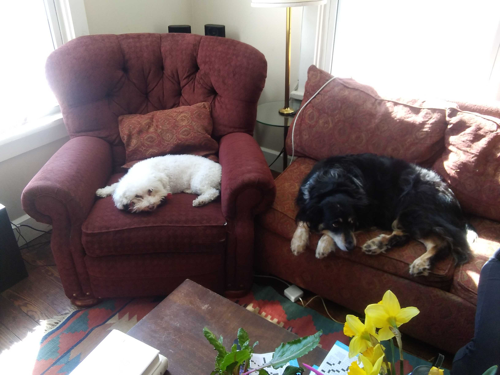

# Houses
BCL has 5 houses across Bloomington. Rooms range from around $500 to $900 depending on house and the quality of the room. We have two suites, in Trellis, which have an additional cost. 

The monthly cost covers includes the cost of the room, utilities, food, and organization maintenance. In addition to the monthly cost, members are expected to do around 5 hours of chores, often two hours of an assigned chore and then three hours of cooking and cleaning, a week. Each house has a weekly meeting on Sunday nights after dinner. These meetings are essential to operation of the houses, as we can keep updated on the house day-to-day items and make sure that issues are addressed promptly.  

## Goodlawn
Goodlawn is located close to campus, on Woodlawn Ave. The house has 11 rooms, with two kitchens, and a lovely porch. 

{: style="height:120px;width:120px"}
{: style="height:120px;width:120px"}
{: style="height:120px;width:120px"}
{: style="height:120px;width:120px"}

## Mercury
Mercury is located on 5th street, occupies a single floor, with no stairs. It is adjacent to Middle Earth. 

## Middle Earth
Middle Earth is the oldest house in BCL, with 20 some rooms across two floors. It is adjacent to Mercury, and very close to downtown Bloomington. The house was previously owned by Middleway and was sold to BCL in 2010. 

## Trellis
Trellis is on the Near West side, next to Butler Park. It is focused on family and multigenerational living, with two suites, lots of common spaces, including two kitchens.
{: style="height:120px;width:120px"}
{: style="height:120px;width:120px"}
{: style="height:120px;width:120px"}  

## Which House
Which House is located just south of Indiana University and a short walk to downtown Bloomington. A quarter mile south, there is Bryan park. 

The house has 13 rooms (lucky us!), with three bathrooms, a kitchen and a kitchenette. 
{: style="height:120px;width:120px"}
{: style="height:120px;width:120px"}
