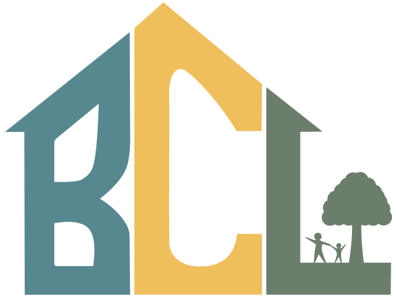

# {: style="height:80px;width:80px"} Bloomington Cooperative Living 

We are Bloomington's primary cooperative living organization. 

In our houses, we share the responsibilities of managing a household as well as the community it creates. Members can expect to:

* Cook for the house on a weekly basis, and enjoy the food cooked by others on a daily basis
* Take up a regular household chore, whether it is getting groceries or cleaning common areas
* Contribute positively to the house's culture and function
* Interact with other members of BCL and the broader community

## Apply to Live at BCL

Fill out our application [here](https://docs.google.com/forms/d/e/1FAIpQLSfDdIf3ke8mepx9VzwtEgYo-GBmQkiMHLKS8C9H5A9DsA44pA/viewform). 

We are currently accepting applications for partial leases (now-ish to August). Partial leases usually have the ability to be extended:

* Mercury - One Room
* Trellis - One Room
* Which House - One Room

Applications for full year leases, August 1 - July 30, are open for:

* Goodlawn - 3 Rooms
* Mercury - 3 Rooms
* Middle Earth - 6 Rooms
* Trellis - 6 Rooms
* Which House - 6 Rooms

For details on the application process and what life is like at BCL, see [Live Here](membership.md)

For details on the individual houses, look at [our houses page](Houses.md)

## I want to be involved, but don't want to live in BCL
Community members are more than welcome to get involved with BCL! 

A great way to start is by becoming a boarder at one of the houses (eat food at the houses regularly), most of the houses offer half or full board. If you are interested in this, contact us through email <> or talk with someone who you know in the organization about it! Often boarders will come over for dinner multiple times a week, sometimes they contribute to the house in various ways, such as giving us extra garden zuchinni. 
